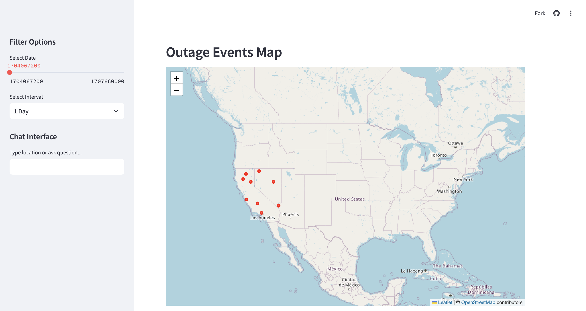

# Intelligent Outage Dashboard



## Project Overview

The Intelligent Outage Dashboard is an interactive web application that visualizes power outage data across California. It provides utilities and emergency management professionals with a real-time view of outage events, enabling better decision-making during critical situations.

Live Demo: [Intelligent Outage Dashboard](https://wadamci-intelligent-outage-dashboard-tests-5kmw85.streamlit.app/)

## Features

### Interactive Map Visualization
- View outage events across California with precise geolocation
- Toggle between point markers (for daily view) and heat maps (for longer periods)
- Zoom to specific regions using natural language commands

### Temporal Analysis
- Filter data by different time intervals (1 Day, 1 Month, 6 Months, 1 Year)
- Use the date slider to navigate through historical outage data
- See how outage patterns change over different time periods

### Statistical Insights
- View key metrics including total outages and affected customers
- Identify most common outage causes
- Access detailed regional breakdown of impact

### Detailed Analysis Reports
- Generate comprehensive analysis reports with a simple chat command
- View cause distribution charts and regional impact tables
- See temporal patterns of outages throughout the day
- Review key insights extracted from the data

### Natural Language Interface
- Control the dashboard using simple text commands
- Ask questions about the data in plain English
- Zoom to specific regions by typing location names
- Get help with available commands by typing "help"

## How to Use

### Basic Navigation
1. Use the sidebar date slider to select your date of interest
2. Choose a time interval from the dropdown (1 Day to 1 Year)
3. View outage events displayed on the California map

### Chat Commands
The dashboard features a chat interface that accepts various commands:

- **Region Navigation**:
  - Type "California" to zoom to the full state
  - Type "Northern CA", "Central CA", or "Southern CA" to focus on specific regions

- **View Switching**:
  - Type "report" or "analysis" to see a detailed outage analysis report
  - Type "map" to return to the map view

- **Data Questions**:
  - Type "how many outages" to see the count of current outages
  - Type "customers affected" to see the total impact
  - Type "cause" to see the most common outage cause
  - Type "help" to see all available commands

## Technical Implementation

The dashboard is built using:
- **Streamlit**: For the web application framework
- **Folium**: For interactive maps
- **Pandas**: For data manipulation and analysis
- **NumPy**: For numerical operations
- **Python datetime**: For temporal data handling

The application uses synthetic data generated with controlled randomness to simulate real-world outage patterns while maintaining privacy.

## Installation and Local Development

### Prerequisites
- Python 3.8+
- pip package manager

### Setup
1. Clone the repository:
   ```bash
   git clone https://github.com/wadamci/intelligent-outage-dashboard.git
   cd intelligent-outage-dashboard
   ```

2. Create and activate a virtual environment:
   ```bash
   python -m venv .venv
   source .venv/bin/activate  # On Windows: .venv\Scripts\activate
   ```

3. Install dependencies:
   ```bash
   pip install -r requirements.txt
   ```

4. Run the application:
   ```bash
   streamlit run tests.py
   ```

## Future Enhancements

- Integration with real-time outage data feeds
- Advanced predictive analytics for outage forecasting
- Mobile-optimized interface for field personnel
- Enhanced natural language processing for more complex queries
- User authentication and personalized dashboards

## License

This project is licensed under the MIT License - see the LICENSE file for details.

## Contact

For questions or feedback, please contact [Your Name/Organization](mailto:wadamc@umich.edu).

---

*Note: This dashboard currently uses synthetic data for demonstration purposes. In a production environment, it would connect to real utility outage data sources.*
